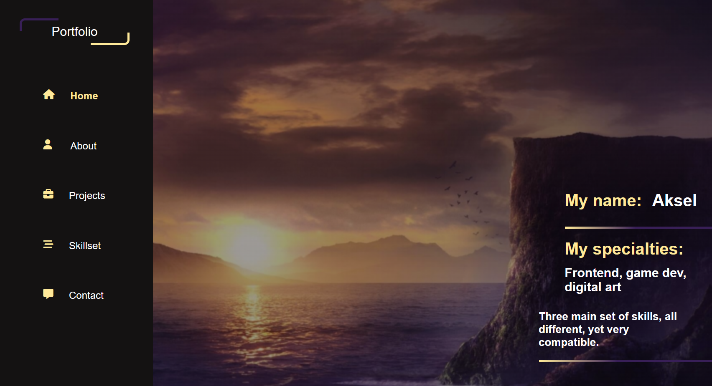

# Portfolio 1

## A collection of my past projects, big or small.

### description

My portfolio contains several types of projects I'm proud of, big or small. 
There are namely three types of projects:

* Frontend: Coding, websites, usually made in Clip Studio Code
* Game development: video games made in game engines such as Unity or Game Maker
* Digital art: Paintings, models made in Clip Studio Paint

There are five pages in my portfolio:
* Home
* About
* Projects
* Skillset
* Contact

All my projects can be found in "Projects".

### Built with

Made in Visual Studio Code with:
* HTML
* CSS
* Javascript

### Contact

Contact information about me is mostly located in "Contact" in the portfolio